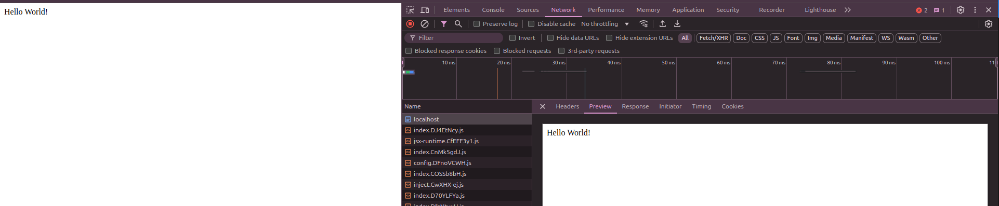
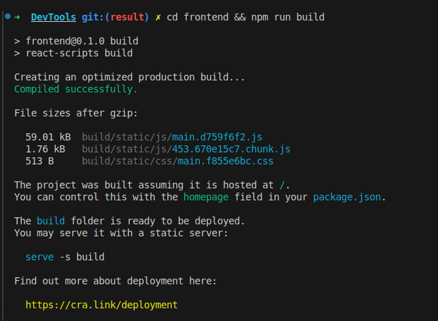
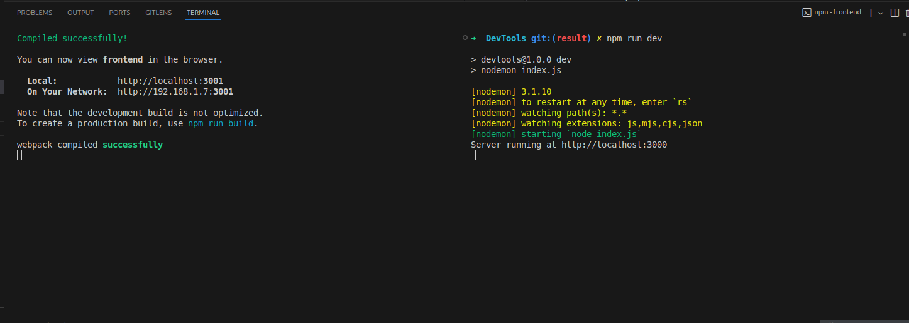
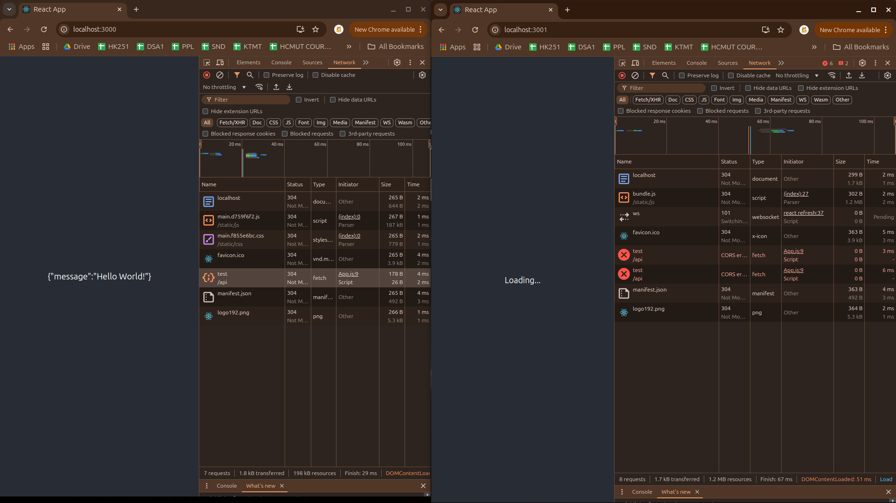
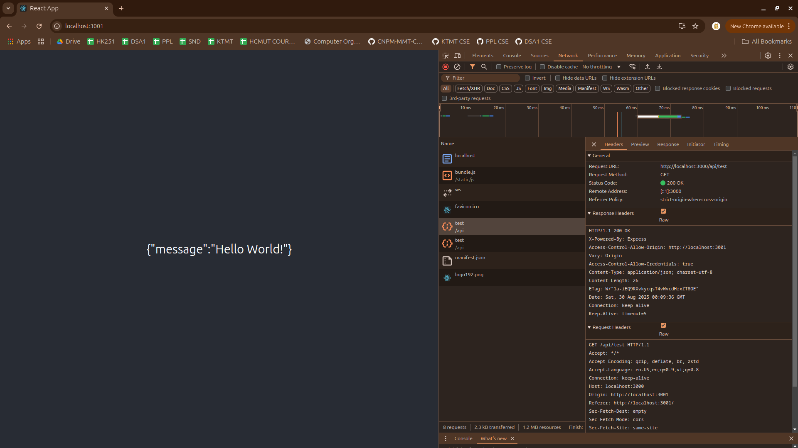
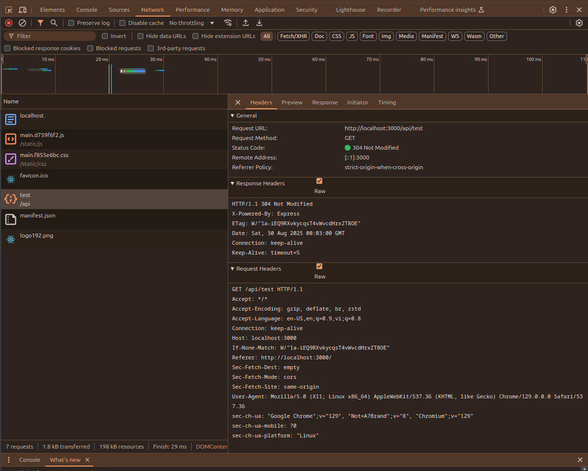
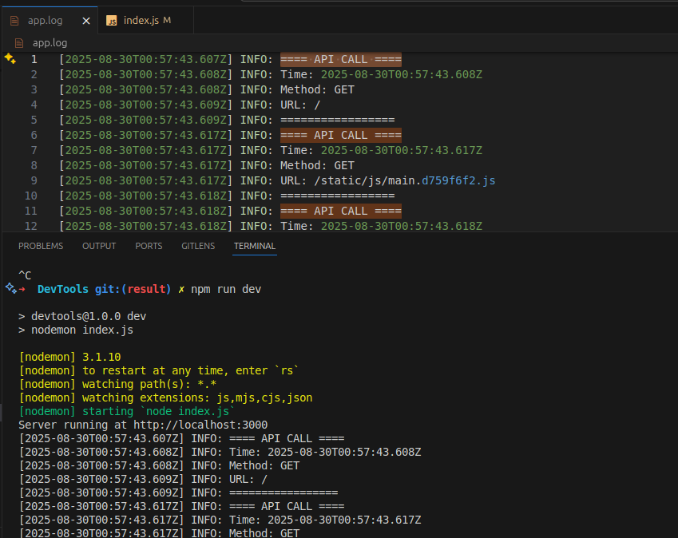

# MMT-HTTP-AND-SETUP-PROJECT

## Node.js Express Backend Basic Project

### 📦 Khởi tạo dự án

```sh
node --version
v20.19.0

# Khởi tạo package.json mặc định
npm init -y

# Cài Express và Nodemon
npm install express
npm install --save-dev nodemon
```

### ⚙️ Cấu hình scripts trong package.json

```json
"scripts": {
  "start": "node index.js",
  "dev": "nodemon index.js"
}
```

### 📝 index.js

```js
// ====================== IMPORTS ======================
const express = require('express');

const app = express();
const port = 3000;

// Middleware parse JSON
app.use(express.json());

// Route gốc
app.get('/', (req, res) => {
  res.send('Hello World!');
});

// ====================== START SERVER ======================
app.listen(port, () => {
  console.log(`Server running at http://localhost:${port}`);
});
```

### 🚀 Chạy server

- Chạy bằng Node.js:

```sh
npm run start
```

- Chạy trong chế độ phát triển (tự reload khi thay đổi code):

```sh
npm run dev
```

- Mở trình duyệt vào: `http://localhost:3000` → sẽ thấy `Hello World!`



## Frontend React Single Page Application

### 📦 Tạo project React

```bash
# Tạo React app trong thư mục 'frontend'
npx create-react-app frontend

# Vào thư mục frontend
cd frontend
```

### 📝 App.js (fetch API từ backend)

```js
import { useEffect, useState } from 'react';
import './App.css';

function App() {
  const [message, setMessage] = useState('');

  useEffect(() => {
    // Gọi API backend
    fetch('http://localhost:3000/api/test')
      .then((res) => res.text())
      .then((data) => setMessage(data))
      .catch((err) => console.error(err));
  }, []);

  return (
    <div className="App">
      <header className="App-header">
        {/* Hiển thị message từ backend */}
        <p>{message ? message : 'Loading...'}</p>
      </header>
    </div>
  );
}

export default App;
```

### 📝 Index.js (backend)

```js
const path = require('path');
app.get('/api/test', (req, res) => {
    res.json({ message: 'Hello World!' });
});

// ====================== REACT BUILD (SPA) ======================
app.use(express.static(path.join(__dirname, 'frontend', 'build')));
app.get(/.*/, (req, res) => {
    res.sendFile(path.join(__dirname, 'frontend', 'build', 'index.html'));
});
```

### Build React (npm run build), Express sẽ serve toàn bộ SPA từ frontend/build. 

```sh
cd frontend && npm run build

npm run dev -> backend port 3000
cd frontend && npm start -> frontend port 3001
```





### ⚠️ Lỗi CORS khi chạy React + backend

**Triệu chứng**
- Khi frontend React (`npm start`) trên port 3000 hoặc 3001 gọi API backend trên port khác, trình duyệt báo lỗi:

```
Access to fetch at 'http://localhost:3000/api/test' from origin 'http://localhost:3001' has been blocked by CORS policy
```

**Nguyên nhân**
- Trình duyệt **chặn request cross-origin** (port khác) vì lý do bảo mật.



**Cách khắc phục**

```js
index.js

const cors = require('cors');
app.use(cors({
    origin: [`http://localhost:${port}`, 'http://localhost:3001'],
    methods: ['GET', 'POST', 'PUT', 'DELETE'],
    allowedHeaders: ['Content-Type', 'Authorization'],
    credentials: true
}));
```



### HTTP – HyperText Transfer Protocol

**Khái niệm**
- HTTP là **giao thức ứng dụng** để client (trình duyệt) và server trao đổi dữ liệu trên mạng.
- Hoạt động theo mô hình **request → response**.

**Flow cơ bản**
1. Client gửi **request** tới server.
   - Các method phổ biến: `GET`, `POST`, `PUT`, `DELETE`.
2. Server xử lý request và trả về **response** gồm:
   - **Status code**: 200 (OK), 404 (Not Found), 500 (Server Error)…
   - **Headers**: thông tin metadata như `Content-Type`, `Authorization`…
   - **Body**: dữ liệu trả về, có thể là HTML, JSON, CSS, JS…


**Ví dụ**
```json
# Request
GET /api/test HTTP/1.1
Host: localhost:3000

# Response
HTTP/1.1 200 OK
Content-Type: application/json

{
  "message": "Hello World!"
}
```

### 🔹 Lưu ý
- HTTP là **stateless**, mỗi request là độc lập.
- RESTful API xây dựng trên HTTP giúp client và server giao tiếp theo chuẩn.

### ⚙️ Cơ chế React SPA + Backend Express

**Khi chạy development (npm start React + backend Node.js)**

```
[Client Browser] 
      |
      | HTTP GET / -> request dev server React (ví dụ port 3001)
      v
[React Dev Server] 
      |
      | serve index.html + bundle JS, CSS
      v
[Client Browser] -> React JS bundle chạy, render UI
      |
      | fetch('/api/...') -> REST API (backend port 3000)
      v
[Backend Express] -> JSON response
      |
      v
[Client Browser] -> Update UI
```

- React chạy trên **dev server** (hot reload, port 3000/3001)  
- Backend Node.js xử lý API riêng, có thể chạy trên port khác  
- Nếu frontend và backend khác port → cần **proxy** hoặc **CORS middleware**

---

**Khi build production (npm run build React + serve bằng Express)**

```
[Client Browser] 
      |
      | HTTP GET / -> request index.html
      v
[Backend Express] 
      |
      | serve frontend/build/index.html
      v
[Client Browser] 
      |
      | Browser tải các file JS, CSS liên kết trong index.html
      v
[Client Browser] -> React JS bundle chạy, render UI
      |
      | fetch('/api/...') -> REST API trên cùng backend
      v
[Backend Express] -> JSON response
      |
      v
[Client Browser] -> Update UI
```

- React build ra **static files** (index.html + JS + CSS)  
- Express serve toàn bộ SPA và xử lý REST API  
- Không còn vấn đề CORS vì frontend và backend chạy cùng port  


---

**Tóm tắt**
- **Dev mode**: React dev server + backend port khác → cần proxy/CORS  
- **Production build**: React static bundle + backend cùng port → SPA + REST API chạy mượt mà

### 🛠️ Sử dụng DevTools của trình duyệt

**1️⃣ Mở DevTools**
- Chrome / Edge / Firefox: nhấn **F12** hoặc **Ctrl+Shift+I** (Windows) / **Cmd+Option+I** (Mac)
- Bao gồm các tab quan trọng:
  - **Elements**: xem cấu trúc DOM, CSS
  - **Console**: xem log JS, lỗi
  - **Network**: theo dõi request/response HTTP
  - **Sources**: xem code JS/React bundle

---

**2️⃣ Theo dõi API call**
1. Mở tab **Network**
2. Nhấn nút gọi API trong React (ví dụ "Refresh API" button)
3. Quan sát request:
   - **Method**: GET, POST…
   - **URL**: `/api/test`
   - **Status**: 200 OK
   - **Response**: `{ "message": "Hello World!" }`



---

## Logging Backend

### 📦 Setup
```js
const winston = require('winston');

// ======================= LOG =================
const logger = winston.createLogger({
    level: 'info',
    format: winston.format.combine(
        winston.format.timestamp(),
        winston.format.printf(({ timestamp, level, message }) => {
            return `[${timestamp}] ${level.toUpperCase()}: ${message}`;
        })
    ),
    transports: [
        new winston.transports.Console(),
        new winston.transports.File({ filename: path.join(__dirname, 'app.log') })
    ]
});

.....

// ====================== LOG MIDDLEWARE ======================
app.use((req, res, next) => {
    logger.info(`==== API CALL ====`);
    logger.info(`Time: ${new Date().toISOString()}`);
    logger.info(`Method: ${req.method}`);
    logger.info(`URL: ${req.originalUrl}`);
    logger.info(`=================`);
    next();
});
```

### Ghi chú

- `winston` hỗ trợ nhiều **transports**: console, file, HTTP, v.v.  
- Log gồm **timestamp**, **level**, và **message**.  
- Hữu ích cho **debug**, **monitoring**, và **audit trail**.



## CRUD and Login Basic

### Cập Nhật App.css App.js index.js trong commit `CRUD and Login Basic`

### Cookie


- **Định nghĩa:** Cookie là một **file nhỏ** được server gửi về trình duyệt client và được lưu trữ trên máy client.  
- **Mục đích:** Lưu trữ thông tin **state** giữa các request HTTP, ví dụ: user preferences, token xác thực, giỏ hàng…  
- **Cách hoạt động:**
  1. Client gửi request đầu tiên tới server.
  2. Server trả về **Set-Cookie** header trong response.
  3. Trình duyệt lưu cookie và gửi lại cookie này trong các request tiếp theo tới cùng server (**Cookie header**).  

- **Ví dụ:**  

```http
# Server gửi cookie
HTTP/1.1 200 OK
Set-Cookie: sessionId=abc123; HttpOnly; Path=/; Max-Age=3600

# Client gửi lại cookie trong request tiếp theo
GET /dashboard HTTP/1.1
Cookie: sessionId=abc123
```

### Session

- **Định nghĩa:** Session là một **vùng lưu trữ tạm thời trên server** để giữ thông tin state của user.  
- **Mục đích:** Giữ thông tin người dùng khi họ tương tác nhiều lần với server, ví dụ: login status, shopping cart…  
- **Cách hoạt động:**
  1. Khi user đăng nhập, server tạo **session object** và gán một **sessionId** duy nhất.
  2. Server gửi sessionId về client dưới dạng cookie.
  3. Client gửi cookie chứa sessionId trong các request tiếp theo.
  4. Server tra cứu sessionId và lấy dữ liệu session tương ứng.


### CRUD – Create, Read, Update, Delete

CRUD là các thao tác cơ bản trên dữ liệu trong ứng dụng web và database, thực hiện thông qua HTTP request:

- Create (POST): Tạo mới dữ liệu trên server.

- Read (GET): Lấy dữ liệu từ server.

- Update (PUT / PATCH): Cập nhật dữ liệu đã tồn tại trên server.

- Delete (DELETE): Xóa dữ liệu trên server.


## Swagger Setup and Postman

### Swagger

**Swagger** là một bộ công cụ mã nguồn mở giúp document, thiết kế và test API RESTful một cách trực quan.

- Cho phép mô tả các endpoint, tham số, response, và header của API.

- Cung cấp giao diện web (Swagger UI) để gọi thử API trực tiếp từ trình duyệt mà không cần frontend.

- Thường được tích hợp trong Node.js/Express bằng swagger-ui-express và swagger-jsdoc.


### Postman
- Postman là công cụ gọi và test API: GET, POST, PUT, DELETE
- Hỗ trợ headers, body, authentication, variables
- Ví dụ:
    1. GET /api/users → xem danh sách user
    2. POST /api/users với JSON body → tạo user mới
    3. PUT /api/users/:id → cập nhật user
    4. DELETE /api/users/:id → xóa user

  
